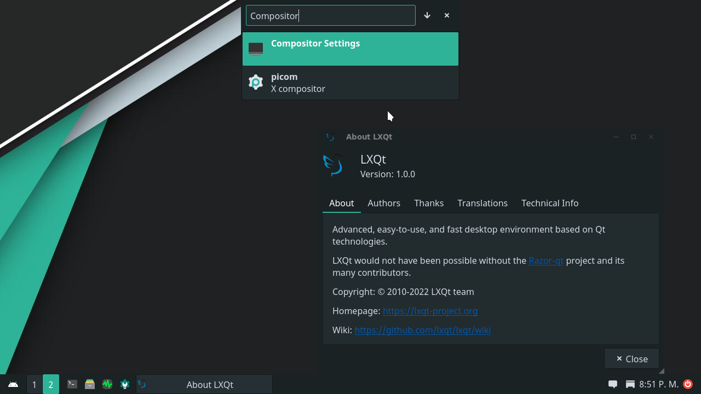

# Downloads

# Available flavors

## **LXQt edition**

LXQt is the fusion of razor-qt and lxde, using the Qt technologies.

LXQt is characterized by being light and easy for the user, it is a complete desktop environment ready for daily use.

The configuration of this environment is maintained by the termux-desktop project.
